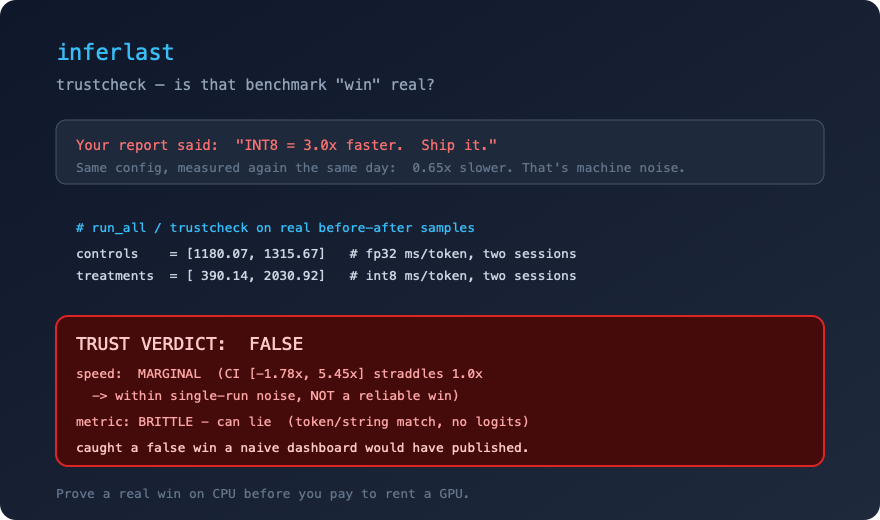
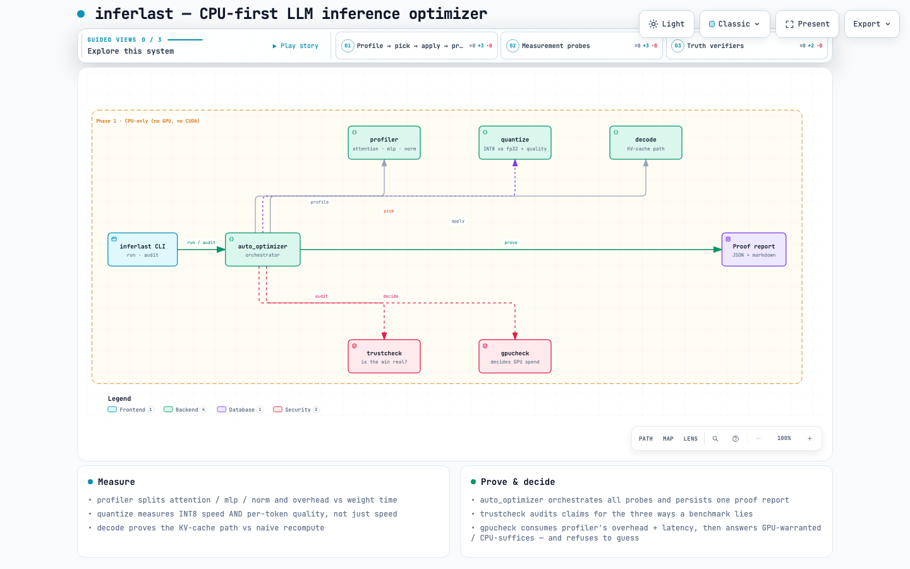

<p align="center">
  <br/>
  
  
  
  <a href="https://pypi.org/project/inferlast/"></a>
  
  <a href="https://github.com/YuvrajSinghBhadoria2/inferlast/releases"></a>
</p>

<h1 align="center">inferlast</h1>
<p align="center"><b>Fine-tune-free, GPU-free inference:</b> prove a real optimization win on a plain laptop CPU <i>before</i> you ever pay to rent one.<br/>
Most demos tell you a change is <b>3x faster</b> — inferlast catches when that number is just machine noise.</p>

<p align="center">
  <a href="#why">Why</a> · <a href="#30-second-try">30-second try</a> · <a href="#what-it-caught">What it caught on my machine</a> · <a href="#how-it-works">How it works</a> · <a href="#roadmap">Roadmap</a>
</p>

---

## Why

Most LLM-inference guides tell you what to do: *quantize to INT8, batch bigger, grab a GPU.* They don't tell you **whether it helps *your* model on *your* hardware** — and they quietly assume you can rent a GPU to find out.

inferlast is the opposite. It is **CPU-first by design**: it profiles and optimizes entirely on the CPU you already have, so **anyone can run it — no GPU, no cloud GPU bill, no CUDA install.** And when you *do* move to a GPU later, inferlast tells you honestly whether it was even worth it.

> **Profile → pick → apply → prove.** And if the measurement says an "obvious" optimization doesn't help, inferlast says so — instead of making you guess wrong.

This is the core of what inference engineers actually do: not "apply the standard thing," but **find where the time really goes and only ship changes that provably pay off** — cheaply enough that you don't need a GPU to do it.

> **Hardware scope — Phase 1 is CPU-only.** Built and measured on a 2019 Intel MacBook Pro 16" (i7-9750H, 6C/12T, 16 GB, no GPU). Findings are CPU-specific and stated as such; on GPU the same model is typically weight-bandwidth-bound, not overhead-bound, so results would differ.

The project is organized around one falsifiable claim — **a decision rule for when GPU spend is actually warranted, estimable from CPU-only measurement.** That thesis, its boundaries, and its frozen success test live in [`docs/RESEARCH-SPEC.md`](docs/RESEARCH-SPEC.md).

## The honest insight it encodes

For tiny models on CPU, inferlast measures that **~98–99% of decode wall time is framework overhead, not model math**. So **blindly quantizing the weights will not speed up an overhead-bound model** — and inferlast *measures* that rather than pretending otherwise. That refusal-to-guess behavior is the whole point.

## Install

```bash
pip install inferlast            # Python 3.10-3.12; CPU-first, no GPU/CUDA needed
```

This installs the core (`import trustcheck`, `import gpucheck`, ...) and the
`inferlast` CLI. Or run straight from the repo:

```bash
git clone https://github.com/YuvrajSinghBhadoria2/inferlast.git
pip install -r requirements.txt
```

## 30-second try

```bash
pip install inferlast                    # CPU-first, no GPU/CUDA needed
inferlast run --model Qwen/Qwen2.5-0.5B-Instruct
```

Or run the full record-persisting pipeline from the repo:

```bash
pip install -r requirements.txt          # torch CPU, transformers, pytest
python scripts/run_all.py --model Qwen/Qwen2.5-0.5B-Instruct
```

One command. One report that tells you:

```
Bottleneck:  mlp 47% · attention 41% · norm 11%   (~99% overhead on CPU)
Decode:      ~1220 ms/token (0.8 tok/s)
Quantization: INT8 = 1.5x but shifts the answer → KEEP fp32 (not a win)
Batching:    B=16 → ~48 tok/s total          Pick B for your goal.
```

And the part that catches the false wins — `trustcheck` on this repo's own
recorded evidence (the same config that reported 3.0x faster):

<p align="center">
  
</p>

Run the individual stages to look closer:

```bash
python scripts/bench.py --model <m>              # prefill profile
python scripts/bench.py --model <m> --decode      # decode / per-token latency
python scripts/bench.py --model <m> --quant       # auto-quantization verdict
python scripts/bench.py --model <m> --batch       # latency vs throughput sweep
python scripts/bench.py --model <m> --trustcheck  # is that win real? (see below)
python scripts/bench.py --model <m> --gpucheck    # do you even need a GPU? (see below)
```

### One-stop: Decide → Deploy

`inferlast run` measures; `inferlast deploy` turns that verdict into a **ready-to-run
serving config** — the answer to the costly "should I rent a GPU here, and if I stay
on CPU, what exactly do I run?" decision:

```bash
inferlast run --model Qwen/Qwen2.5-0.5B-Instruct --out ./verdict   # measure ([MEASURED])
inferlast deploy --from ./verdict/create.json \
    --latency-target-ms 1000 --req-per-hr 100 --out ./deploy       # decide + emit config
```

`deploy` returns **CPU-suffices / GPU-warranted / insufficient-data** (via `gpucheck`),
then emits an executable server command for the right branch — pure-CPU
`llama-server` with GGUF Q4_K_M, or `vLLM` for GPU — plus an honest, cited cost-sanity
rule and a `deploy.json` + `run.sh` artifact. It never overclaims: GPU-warranted means
"a GPU can *plausibly* win, verify on the GPU," and every config says to re-measure
tok/s on your target hardware. The design and its sources are in
[`docs/DECIDE-DEPLOY-SPEC.md`](docs/DECIDE-DEPLOY-SPEC.md).

**Worked example** (loose latency + low traffic → keep it on CPU):

```bash
# 1) measure on YOUR machine (no GPU needed)
inferlast run --model Qwen/Qwen2.5-0.5B-Instruct --out ./verdict

# 2) decide + get a ready-to-run config
inferlast deploy --from ./verdict/create.json \
    --latency-target-ms 1000 --req-per-hr 100 --out ./deploy
```

```
verdict: CPU-suffices
deploy target: cpu
## Run this (llama.cpp (llama-server))
llama-server -m Qwen/Qwen2.5-0.5B-Instruct-Q4_K_M.gguf -ngl 0 -t 12 -c 4096 -b 16 --host 0.0.0.0 --port 8080
```

That command is also written to `./deploy/run.sh` (with `./deploy/deploy.json`
for the auditable decision inputs). Tighten `--latency-target-ms` to `100` and the
same report instead answers `GPU-warranted` → a `vllm serve` command — but always
says "verify tok/s on the actual GPU before scaling spend."

## What it caught on my machine

A quiet, annoying truth that most optimization tutorials skip: **on an overhead-bound CPU model, INT8 quantization is not a free win.** inferlast measured it three ways and told the truth:

| | fp32 | INT8 | verdict |
|---|---|---|---|
| speed (Qwen 0.5B) | 1.31 s/tok | 0.87 s/tok | 1.5x — *but* |
| quality (logit-cosine) | — | 0.68 | preserved-ish |
| quality (top-5 overlap) | — | **0.15** | **token ranking shifted** |

INT8 was faster but disturbed what the model would actually say. inferlast's call: **KEEP fp32.** That's not a bug — it's the tool doing its job: *refuse to recommend a change that isn't a real win.*

The full measured records are in `benchmarks/` (JSON + markdown), published as measured — the failures included.

## How it works

Seven small modules, one job each:

| Module | Job |
|---|---|
| `src/profiler.py` | Per-category (attention / mlp / norm / embed / head) wall-clock profile, and the overhead-vs-weight split. |
| `src/quantize.py` | Auto-quantization (INT8 dynamic). Measures fp32 vs INT8 averaged over repeats, with a **robust quality metric** (per-token logit cosine + top-5 overlap) — not brittle greedy-token identity. |
| `src/batcher.py` | Latency-vs-throughput sweep over batch size, with a best-batch picker. |
| `src/trustcheck.py` | **Is that 'win' worth trusting?** Audits any before/after benchmark for the three ways it lies: single-run noise, a brittle/wrong metric, and a "validated, documented, read by nothing" knob. Returns a REAL / MARGINAL / FALSE verdict. |
| `src/gpucheck.py` | **Do you even need a GPU?** Estimates, from CPU-only measurements, whether GPU spend would actually beat the best-scheduled CPU config. Returns GPU-warranted / CPU-suffices / insufficient-data — and refuses to guess when it can't tell. |
| `src/deploy.py` | **Decide → Deploy.** Turns the measured verdict into a ready-to-run serving config: CPU (`llama-server`, GGUF Q4_K_M, pure CPU `-ngl 0`) or GPU (`vLLM`), plus an honest, cited cost-sanity rule and a `deploy.json` + `run.sh` artifact. One command from measure to deploy. |
| `src/auto_optimizer.py` | Orchestrator: runs all four, emits a combined proof report + JSON. |
| `scripts/` | `run_all.py` (one command) + `bench.py` (per stage). |

A key design decision: `run_all.py` **always persists** a canonical report, so the evidence on disk always matches the latest run — it can't go stale.

## Architecture

<p align="center">
  <a href="docs/diagram/inferlast-architecture.html" title="Open the interactive animated architecture diagram">
    
  </a>
</p>

## gpucheck — the part that stops you overspending on hardware

The whole project is built around one falsifiable claim (in
[`docs/RESEARCH-SPEC.md`](docs/RESEARCH-SPEC.md)): **for overhead-bound small models on CPU, you
usually don't need a GPU at all.** `gpucheck` puts that to the test from local CPU measurement:

```bash
python scripts/bench.py --model <m> \
  --gpucheck --num-params 0.5e9 --overhead-fraction 0.98 --latency-target-ms 2000
```

It labels the decision — **GPU-warranted / CPU-suffices / insufficient-data** — with the exact inputs
and reasoning, and it **refuses to guess** (returns `insufficient-data`) whenever it genuinely cannot
tell from the data you gave it. That refusal is a feature: it never sells you a GPU rental it can't
defend.

## trustcheck — the part that tells you your benchmark lied

Most tools *produce* a number. `trustcheck` tells you whether to believe it. It caught all three lies live on this repo's own evidence:

- **Single-run noise.** The same INT8-vs-fp32 config, measured twice, gave `3.0x` faster in one session and `0.65x` **slower** in another. `trustcheck` computes the confidence interval and says: *"CI [-1.8x, 5.5x] straddles 1.0x → not a reliable win."* A naive dashboard would have reported `3.0x`.
- **Brittle metric.** A quality comparison at greedy-token level, with no logits, is flagged as "can lie" and, when logits are available, re-measured with logit cosine + top-5 overlap.
- **Read-by-nothing knob.** A flag that is documented/validated but never read by any code is a silent bug (the class of bug Soup and vLLM chased); `trustcheck`'s static pass flags it.

```bash
python scripts/bench.py --trustcheck \
  --controls 1180 1316 --treatments 390 2031      # audit two real sessions
python scripts/bench.py --model <m> --trustcheck \
  --collect-repeats 2 --config-key stream_layers   # measure the noise band live
```

## Tests

```bash
pip install pytest
python -m pytest        # 57 fast tests, no model downloads
```

The suite guards the things that would sink a tool like this: profiler categorisation & no-double-counting, the robust INT8 quality metric + the honest decision rule, batcher best-batch selection, the `trustcheck` noise/brittle-metric/read-by-nothing logic, the `gpucheck` GPU-necessity decision rule (including its refusal to guess when data is missing), and a **regression test that the report always emits the new metrics — never a stale one.**

## Roadmap

Phase 1 is done and runs on a plain laptop CPU — no GPU needed.

**Shipped:**

- **`inferlast` on PyPI** — `pip install inferlast` gives you the CLI + core, verified end-to-end.
- **`trustcheck` — the false-win catcher.** Tells you the benchmark you were
  about to publish is machine noise, not a win. It caught *this repo's own*
  3.0x-vs-0.65x as noise.
- **`gpucheck` — "do you even need a GPU?"** A CPU-only decision rule:
  GPU-warranted / CPU-suffices / insufficient-data. It refuses to guess when it
  can't tell.
- Bottleneck / decode / quant / batch selection.

**Where we want help next** (strongest help first):

- **Validate the `gpucheck` boundary on hardware we can't reach.** Your numbers
  ship behind an honest "requires <hardware>" gate — a 4 GB card, an Apple
  Silicon box, a desktop with more RAM. Proof on hardware we lack turns a claim
  into a finding. *This is the most valuable way to contribute right now.*
- Quantization beyond INT8 (FP4 / INT4), latency percentiles (p50/p99), memory /
  KV-cache footprint, and serving-engine integration (vLLM / llama.cpp) as an
  enrichment layer.

PRs welcome. Nothing here is a live claim — it's the plan.

## License

MIT — free, stays free, built in the open. If inferlast saved you a guessing session, a star helps others find it.

<sub>Not a replacement for vLLM / llama.cpp — a *decision layer* that runs on CPU and tells you which setting is right for your model and hardware, with proof, before you spend on a GPU.</sub>